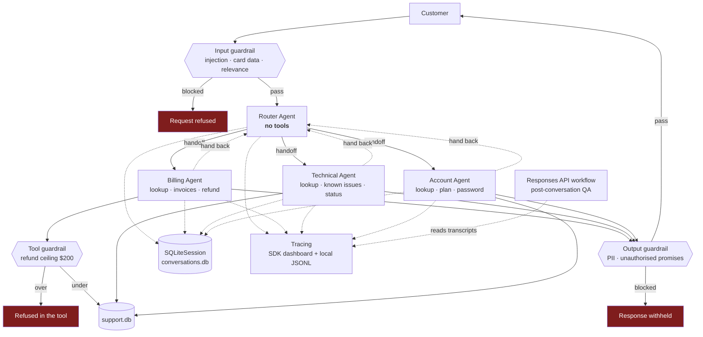

# Architecture Notes

## Components

| Component | File | Responsibility |
|---|---|---|
| Router | `src/agents_def.py` | classify intent, hand off, own no tools |
| Billing / Technical / Account | `src/agents_def.py` | resolve within scope, hand back on mismatch |
| Tools | `src/tools.py` | the support database, plus the refund ceiling |
| Guardrails | `src/guardrails.py` | input and output layers |
| Session | `src/main.py` | `SQLiteSession`, persisted, resumable |
| Responses workflow | `src/responses_workflow.py` | direct `responses.create` QA review |
| Tracing | `src/tracing.py` | structured JSONL alongside the SDK's dashboard upload |
| Provider switch | `src/config.py` | OpenAI or any OpenAI-compatible gateway |

## Why handoffs rather than delegation

The router does not call a specialist and wait for a result. **Control
transfers.** The receiving agent owns the conversation from that point, with its
own instructions and its own tools; the router steps out of the way.

Two consequences shape the design:

- **The router is constructed with no tools at all.** It cannot answer a
  substantive question even if the model wanted to, so it cannot half-solve
  something and hand over a mess.
- **Specialists can hand back.** A customer who switches from billing to a
  technical question gets re-routed rather than answered badly by whoever
  happened to pick up. The graph has a cycle, deliberately.

Handoff is the right primitive here because support conversations *change
owner*. Contrast the Module 6 diagnostics system, where a supervisor delegates,
waits, and synthesises — there the answer needs two specialists at once. Here it
needs exactly one, and which one can change mid-conversation.

## Tool scope is the security boundary

| Agent | Tools | Can refund? | Can reset passwords? |
|---|---|---|---|
| Router | — | No | No |
| Billing | `lookup_customer`, `get_invoices`, `issue_refund` | Yes, ≤ $200 | **No** |
| Technical | `lookup_customer`, `search_known_issues`, `check_service_status` | **No** | **No** |
| Account | `lookup_customer`, `update_plan`, `send_password_reset` | **No** | Yes |

A technical agent cannot issue a refund however the request is phrased, because
the tool is absent from its construction. This is enforced structurally, not by
instruction, and `scripts/mock_test.py` asserts it.

## Three guardrail layers

| Layer | Runs | Catches | Bypassable by prompt? |
|---|---|---|---|
| Input | before the agent | injection, card data, off-topic | No — it runs first |
| Output | on the final response | PII echo, unauthorised promises | No — it runs last |
| **Tool** | inside `issue_refund` | refunds above $200 | **No — it is code on the execution path** |

The tool guardrail is the one that matters. Input and output guardrails reduce
the chance the model does something wrong; the tool guardrail makes it
impossible. A refund above $200 is refused by a Python `if`, and no amount of
persuasion changes a Python `if`.

Two implementation details worth naming:

**Deterministic checks run before model checks.** Pattern matching is free and
never hallucinates, so it runs first; the relevance model only runs when the
patterns are inconclusive. A guardrail that costs as much as the request it
guards will be switched off within a quarter.

**Luhn validation prevents the obvious false positive.** A naive 13–19 digit
regex flags order numbers as card numbers. Running Luhn means
`4539148803436467` is blocked and `1234567890123` is not.

## Conversation state

`SQLiteSession` keyed on conversation id, persisted to `data/conversations.db`.
State survives a process restart, so `--chat ticket-42` twice resumes rather
than starting over.

The demo proves it: turn 2 says *"can you refund the duplicate?"* with no
invoice number, and it resolves only because turn 1 is in the session.

## Responses API workflow

`src/responses_workflow.py` calls `client.responses.create` **directly**,
outside the Agents SDK, for post-conversation QA review. Deliberately a
different shape:

| | Agent loop | Responses workflow |
|---|---|---|
| Framework | Agents SDK | direct API call |
| State | `SQLiteSession`, client-side | `previous_response_id`, **server-side** |
| Tools | yes | none |
| Handoffs | yes | none |
| Output | free text | `json_schema`, strict |

Reviewing a completed transcript is single-shot analysis with no tools and no
handoffs. Routing it through the agent framework would add machinery for
nothing. **Use the framework where its features earn their cost.**

`review_batch` threads reviews server-side: each call after the first sends only
the new transcript, and the API retains prior context. That is the property
`previous_response_id` buys, and it is the clearest contrast with the
client-side session used in the agent loop.

## Tracing

Two sinks, on purpose:

- **SDK → OpenAI dashboard.** `trace(workflow_name="support-triage",
  group_id=conversation_id)` groups a whole turn into one trace, so a multi-turn
  conversation is inspectable as a unit. Source of the screenshots in
  `docs/screenshots/`.
- **Local structured JSONL** (`src/tracing.py`). Machine-readable, committed to
  the repo, and it still works against a gateway where dashboard upload is
  unavailable.

The second exists because a deliverable that depends on a dashboard login is not
evidence a grader can check.

## Provider switch

`src/config.py` supports OpenAI (Responses API, the SDK default) and any
OpenAI-compatible gateway (chat completions). The agent graph, handoffs,
guardrails and sessions are identical either way — only the model client
changes. Provider choice is infrastructure, not application logic.

One non-obvious detail encoded there: a gateway that authenticates on a custom
header may forward the client's `Authorization` header verbatim upstream, where
it is rejected. `config.py` strips it via an httpx request hook, because the
OpenAI client requires a non-empty `api_key` and always turns it into a bearer
header — there is no constructor flag that suppresses it.

## Verification strategy

`scripts/mock_test.py` runs 53 checks with **zero API calls**: guardrail
patterns, Luhn, the refund ceiling, tool scope, and the full handoff graph. All
of that is deterministic, so it is verified offline.

Only the model's routing *choice* needs a live run. That split means a failure
after `mock_test` passes is a routing or infrastructure problem, never a logic
one — which is what made the three live-run defects quick to isolate.

## Known defects, found and fixed

| ID | Defect | Fix |
|---|---|---|
| BUG-001 | Input guardrail scanned the whole accumulated session, so a message blocked on turn 1 re-tripped on every later turn and the conversation was permanently stuck | `_latest_user_text()` — judge only the newest message |
| BUG-002 | `ModelSettings(temperature=...)` rejected with a 400 by the gpt-5 family | removed; determinism comes from narrow instructions and tool scope |
| BUG-003 | Gateway 401 from *upstream*, not the gateway — the client's `Authorization` header was forwarded verbatim | strip it in an httpx request hook |

BUG-001 is the interesting one. A guardrail that permanently bricks a
conversation is worse than one that misses, and the reported finding pointed at
the wrong message — so the symptom actively misled diagnosis.
