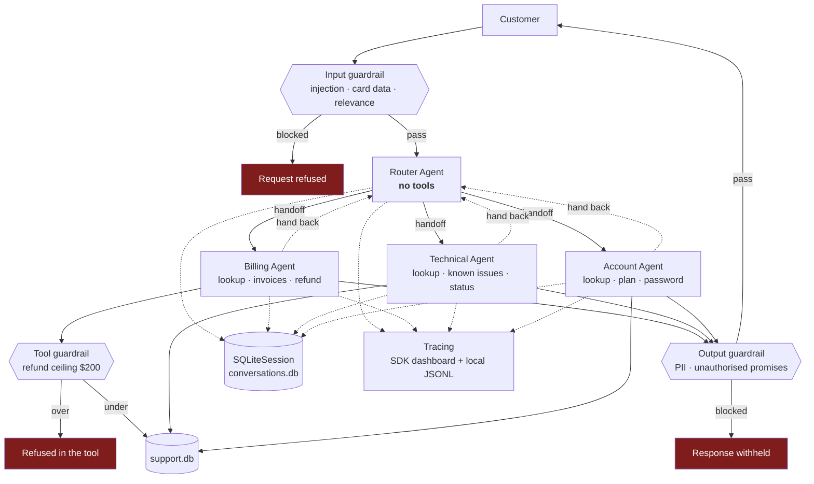

# Design Document

## The system

A customer-support triage system. A router classifies intent and **hands off**
to one of three specialists, which own the conversation from that point.
Guardrails run at three layers, conversation state persists to SQLite, and every
agent decision, handoff and tool call is traced.

## Handoffs, not delegation

The router does not call specialists and wait for results. **Control
transfers.** The receiving agent owns the conversation, with its own
instructions and its own tools; the router steps out of the way.

Two consequences shape everything else:

- **The router is constructed with no tools at all.** It cannot answer a
  substantive question even if the model wanted to, so it cannot half-solve
  something and hand over a mess.
- **Specialists can hand back.** A customer who switches from a billing question
  to a technical one gets re-routed rather than answered badly by whoever
  happened to pick up. The graph has a cycle, deliberately.

Handoff is the right primitive here because support conversations *change
owner*. Contrast a diagnostics system where a supervisor delegates, waits and
synthesises — there the answer needs two specialists at once. Here it needs
exactly one, and which one can change mid-conversation.

## Tool scope is the security boundary

| Agent | Tools | Can refund? | Can reset passwords? |
|---|---|---|---|
| Router | — | No | No |
| Billing | `lookup_customer`, `get_invoices`, `issue_refund` | Yes, ≤ $200 | **No** |
| Technical | `lookup_customer`, `search_known_issues`, `check_service_status` | **No** | **No** |
| Account | `lookup_customer`, `update_plan`, `send_password_reset` | **No** | Yes |

A technical agent cannot issue a refund however the request is phrased, because
the tool is absent from its construction. Enforced structurally, not by
instruction, and asserted in `scripts/mock_test.py`.

## Three guardrail layers

| Layer | Runs | Catches | Can a prompt bypass it? |
|---|---|---|---|
| **Input** | before the agent | injection, card data, off-topic | No — it runs first |
| **Output** | on the final response | PII echo, unauthorised promises | No — it runs last |
| **Tool** | inside `issue_refund` | refunds above $200 | **No — it is code on the execution path** |

The tool guardrail is the one that matters. Input and output guardrails reduce
the chance the model does something wrong; the tool guardrail makes it
impossible. A refund above $200 is refused by a Python `if`, and no amount of
persuasion changes a Python `if`.

Four design details worth naming:

**Deterministic checks run before model checks.** Pattern matching is free and
never hallucinates, so it runs first; the relevance model only runs when the
patterns are inconclusive. A guardrail that costs as much as the request it
guards will be switched off within a quarter.

**Luhn validation prevents the obvious false positive.** A naive 13–19 digit
regex flags order numbers as card numbers. Running Luhn means
`4539148803436467` is blocked and `1234567890123` is not — verified alongside a
check that ordinary support traffic passes cleanly. **A guardrail is only
credible if you test what it lets through, not just what it blocks.**

**The input guardrail judges only the newest message.** With a session, the SDK
passes the full accumulated history. Scanning all of it means a message blocked
on turn 1 re-trips on every later turn — the conversation becomes permanently
stuck, and the reported finding points at the *wrong* message, so the symptom
actively misleads diagnosis. A guardrail that permanently bricks a conversation
is worse than one that misses.

**Refusals return a next step.** Every refusal from `issue_refund` carries the
escalation path or the maximum refundable amount. A refusal with no next step
reads as a dead end and generates a second contact — the control works and the
customer experience still fails.

## Stateful conversations

`SQLiteSession` persists to `data/conversations.db`, keyed on conversation id,
so state survives a process restart. The demo proves it: turn 2 says *"can you
refund the duplicate?"* with no invoice number, and it resolves only because
turn 1 is in the session.

State is keyed on the **conversation**, not the process. A customer returning to
a ticket tomorrow resumes rather than repeating themselves —
`python -m src.main --chat ticket-42` twice picks up where it left off.

## Responses API workflow

`src/responses_workflow.py` calls `client.responses.create` **directly**,
outside the Agents SDK, for post-conversation QA review. Deliberately a
different shape:

| | Agent loop | Responses workflow |
|---|---|---|
| Framework | Agents SDK | direct API call |
| State | `SQLiteSession`, client-side | `previous_response_id`, **server-side** |
| Tools | yes | none |
| Handoffs | yes | none |
| Output | free text | `json_schema`, strict |

Reviewing a completed transcript is single-shot analysis with no tools and no
handoffs. Routing it through the agent framework would add machinery for
nothing. **Use the framework where its features earn their cost** — and showing
where they do not is the point of including this workflow at all.

`review_batch` threads reviews server-side: each call after the first sends only
the new transcript, and the API retains prior context. The reviewer can notice
patterns across conversations without re-uploading everything each time. That is
the property `previous_response_id` buys, and it is the clearest contrast with
the client-side session used in the agent loop.

## Tracing

Two sinks, on purpose:

- **SDK → OpenAI dashboard.** `trace(workflow_name="support-triage",
  group_id=conversation_id)` groups a whole turn into one trace, so a multi-turn
  conversation is inspectable as a unit. Source of the screenshots.
- **Local structured JSONL** (`src/tracing.py`). Machine-readable, committed,
  and it still works against a gateway where dashboard upload is unavailable.

`scripts/build_docs.py` generates `sample-interactions.md` from those traces
rather than from a hand-written transcript. **A hand-written transcript is
unfalsifiable** — anyone can type what an agent "would" say. A document
generated from the trace can only contain what actually happened.

## Verification strategy

`scripts/mock_test.py` runs **53 checks with zero API calls**: guardrail
patterns, the newest-message scope, Luhn, the refund ceiling, the double-refund
guard, tool behaviour, and the full handoff graph.

All of that is deterministic, so it is verified offline. Only the model's
routing *choice* needs a live run. That split means a failure after `mock_test`
passes is a routing or infrastructure problem, never a logic one — which is what
makes live failures quick to isolate rather than open-ended.

## Cost

| Path | Model | Approx per turn |
|---|---|---|
| Input guardrail, deterministic | none | $0 |
| Input guardrail, relevance | `gpt-5-nano` | ~$0.0002 |
| Router | `gpt-5-mini` | ~$0.001 |
| Specialist + tools | `gpt-5-mini` | ~$0.003 |
| Output guardrail | none (deterministic) | $0 |

**~$0.004 per turn.** The full demo plus the guardrail demo is well under $0.10.
Both guardrails are deterministic in the common case, which is why they add
essentially nothing to the bill — and a blocked request costs nothing at all,
because it never reaches a model.

## What is deliberately not built

**No human-handoff queue.** Escalation is named in the responses; wiring a real
queue is integration work, not agent design.

**No RAG over documentation.** `search_known_issues` is keyword search over a
small table. Retrieval quality is a separate problem and would obscure the
handoff and guardrail behaviour this lab is about.

**No streaming.** `Runner.run_streamed` would improve perceived latency in a
real product. It complicates trace output without changing anything being
assessed here.

**No per-call temperature.** The gpt-5 family reject `temperature` with a 400.
Determinism comes from narrow instructions and tool scope, which is where it
should come from anyway — temperature was never a real control on routing.
